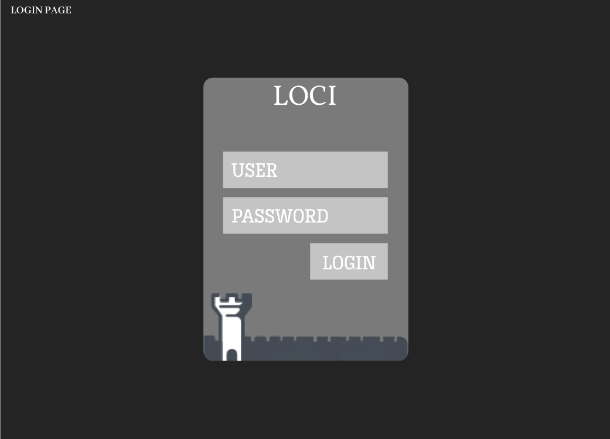

# Loci

 

This is my personal project to improve the quality of my study in Economics, Mathematics and Statistics. The problem that I want to solve is the difficulty of organizing the materials produced throughout the study sections and the management of the necessary revisions to keep theses subjects in the long-term memory. The name "Loci" is an allusion to the [Loci Method](https://en.wikipedia.org/wiki/Method_of_loci) (aka Palace of the Mind).  
Initially, I intend to allow various types of input for study sections such as: word documents, jpeg, pdf, flash cards. In the case of flash cards, I intend to produce a native solution on the platform itself. All data will be stored locally and can be exported as a backup.

---

## The program will have the following features:
- [ ] Login and Password
- [ ] Register of Disciplines
- [ ] Register of Subjects by Disciplines
- [ ] Register of Materials produced in the study sections
- [ ] Search for the Materials produced
- [ ] Guide to content review sections
- [ ] Monitoring statistics
- [ ] Backup Export 

---

## Roadmap to development
### Front-End
- [ ] First page login
- [ ] Home page
  - [ ] Total concepts learned by Subject
  - [ ] Last 30 days learned
  - [ ] Piechart by subject
  - [ ] List of books used
- [ ] Study page
  - [ ] Registration of a concept
  - [ ] Registration of a overview of this concept
  - [ ] Registration of the resource
  - [ ] Setting the Subject
  - [ ] Setting the Topic
- [ ] Revision page
  - [ ] Random review
  - [ ] Review by subject
  - [ ] Review by date
  - [ ] Review by number of errors
- [ ] Settings page
  - [ ] Subjects editor
  - [ ] Login settings

### Back-end
- [ ] Data Base Management System - DBMS
- [ ] Database Tables

---

## Some photos of the project
### Login Page

---

## Some links to use later
### For technical stuff

### For educational stuff
 - [5 Methods to take notes in studying sessions](https://www.oxfordlearning.com/5-effective-note-taking-methods/)